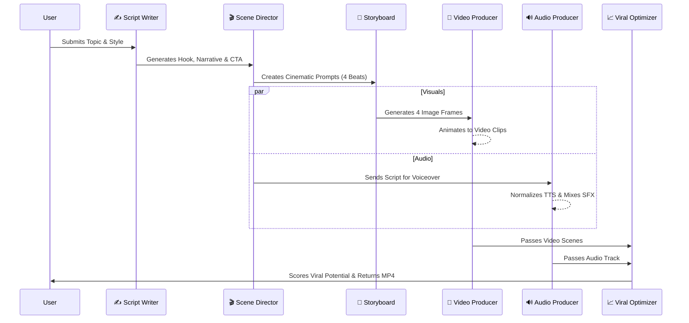
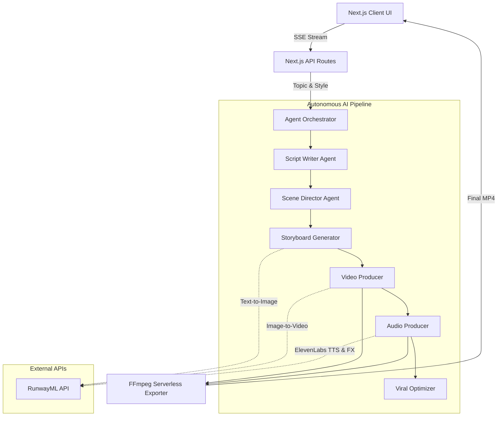

# ReelForge AI

ReelForge AI is an autonomous creative studio designed to transform a simple text idea into a polished, production-ready short-form video (Reel/TikTok/Short) in minutes. Built with Next.js, our platform uses a 6-agent AI pipeline to automatically write viral scripts, direct cinematic scenes, generate visual storyboards, animate video clips, mix audio, and analyze the final output for viral potential before exporting it as a seamlessly concatenated MP4.

### 🌟 Why This Matters

Content creation is currently bottlenecked by the extreme technical friction of video editing, specialized prompting, and audio mixing. ReelForge AI abstracts away this entire complexity layer. By orchestrating powerful multi-modal models (Text-to-Image, Image-to-Video, Text-to-Speech) in parallel, it empowers creators, marketers, and developers to scale their ideas into high-quality, viral-ready videos effortlessly.

## Live Demo

🚀 **[Experience ReelForge AI Live](https://reelforge-ai-delta.vercel.app)**  
*Test the live application and watch the autonomous agents generate your video in real-time.*

## Video Preview

<div align="center">
  <video src="https://github.com/user-attachments/assets/37cc8abd-9bd4-4852-9465-b4763bfe9dab" controls="controls" width="800" class="d-block rounded-bottom-2 border-top width-fit" style="max-height:640px; min-height: 200px">
  </video>
  <p><em>A full walkthrough of the ReelForge AI generation pipeline from text prompt to final viral MP4.</em></p>
</div>

## Application Interface

### Home and Idea Input

  
*A clean, minimalistic landing page where creators input their initial video concepts.*

### Generation Form

  
*Granular controls allow users to define the cinematic style, aspect ratio (9:16 or 16:9), and provide reference imagery.*

### Agent Pipeline

  
*Real-time Server-Sent Events (SSE) tracking of all 6 agents working in parallel to build the video.*

### Generated Video Clips

  
*High-fidelity video clips generated via Runway's Image-to-Video models based on the storyboard prompts.*

### Storyboard, Audio, and Script

  
*A comprehensive breakdown of the generated script, voiceover timings, and normalized sound effects.*

### Final Reel Preview

  
*The final, seamlessly concatenated MP4 reel ready for immediate playback and download.*

### Viral Analysis

  
*An intelligent breakdown of the video's viral potential, complete with an automated improvement loop for refinement.*

## Features

- Six-step AI creative pipeline with Server-Sent Events progress updates and per-agent completion percentages.
- Script generation with hook, narrative, CTA, scene dialogue, and narration timing.
- Scene prompt generation for cinematic visual direction.
- Runway image and video generation with limited concurrency and retry/fallback behavior.
- Context-aware narration voice selection using Runway Text-to-Speech presets.
- Ambient background sound generation through Runway/ElevenLabs sound effects.
- Narration normalization to match the final reel duration.
- Viral score dashboard with hook, visual impact, emotional resonance, and pacing feedback.
- "Make It More Viral" improvement loop that rewrites and regenerates the reel.
- MP4 export with scene concatenation, optional burned captions, narration, and SFX mixing.

## Voice Selection

Narration voice is selected automatically from the reel style, topic, script text, and scene moods. The current natural creator voice palette is:

| Style | Male preset | Female preset | Default gender |
| --- | --- | --- | --- |
| cinematic | Mark | Serene | male |
| energetic | James | Kylie | male |
| minimal | Noah | Eleanor | female |
| dramatic | Elias | Mabel | male |
| inspirational | Arjun | Rachel | female |

The old energetic male preset `Elliot` is no longer used by the app's context-aware voice selection. It remains only in the low-level Runway preset allowlist because it is still a valid provider preset.

## Agent Flow Pipeline

ReelForge AI orchestrates its agents in parallel where possible, maximizing speed and efficiency.



*Default reel timing is four scenes at five seconds each, for a 20 second reel.*

## System Architecture



## Tech Stack

- Next.js 16 App Router
- React 19
- TypeScript
- Runway SDK
- ElevenLabs models through Runway for narration and sound effects
- FFmpeg and FFprobe via `ffmpeg-static` and `ffprobe-static`
- Framer Motion
- Lucide React

## Getting Started

Install dependencies:

```bash
npm install
```

Create `.env.local` with your Runway key:

```bash
RUNWAYML_API_SECRET=your_runway_api_secret
MOCK_MODE=false
```

Optional local media binary overrides:

```bash
FFMPEG_BIN=C:\path\to\ffmpeg.exe
FFPROBE_BIN=C:\path\to\ffprobe.exe
```

Run the development server:

```bash
npm run dev
```

Open `http://localhost:3000`.

On Windows PowerShell, if execution policy blocks `npm.ps1`, use:

```bash
npm.cmd run dev
```

## Scripts

```bash
npm run dev      # Start the Next.js dev server
npm run build    # Build production assets and run TypeScript checks
npm run start    # Start the production server after build
npm run lint     # Run ESLint
```

## API Routes

- `POST /api/generate` - starts the full generation pipeline and streams SSE events.
- `POST /api/improve` - runs the viral improvement loop from an existing script and score.
- `POST /api/export-reel` - exports generated scenes and audio as an MP4 download.

Generation requests use:

```ts
{
  topic: string;
  style: 'cinematic' | 'energetic' | 'minimal' | 'dramatic' | 'inspirational';
  format: '9:16' | '16:9';
  referenceImageUrl?: string;
}
```

## Vercel Deployment

This project is optimized for deployment on Vercel's serverless environment, with proper bundling for `ffmpeg-static` binaries. 

If GitHub integrations fail or you want to deploy directly from your local terminal, use the Vercel CLI:

```bash
npx vercel@latest deploy --prod
```
Ensure you have the following Environment Variables set in your Vercel project settings:
- `RUNWAYML_API_SECRET`
- `MOCK_MODE=false`

## Environment Notes

- `RUNWAYML_API_SECRET` is required unless `MOCK_MODE=true`.
- `MOCK_MODE=true` avoids real Runway calls and returns sample media URLs for local testing.
- API routes have a 300 second max duration because image, video, audio, and export jobs can take time.
- Export uses temporary files and cleans them up after the MP4 response is created.

## Project Structure

```text
src/app/                  Next.js pages and API routes
src/components/           UI for input, pipeline progress, previews, player, and viral score
src/lib/agents/           Script, scene, storyboard, video, audio, and viral agents
src/lib/runway-client.ts  Runway API wrapper, retries, mock mode, and voice preset validation
src/lib/server/           FFmpeg, FFprobe, download, and audio normalization helpers
src/lib/types.ts          Shared request, response, pipeline, and media types
```

## Troubleshooting

- **`Cannot find module 'framer-motion'` or `components.ComponentMod.handler is not a function`**: Turbopack's cache may be corrupted. Stop the server, delete the `.next` directory (`rm -rf .next` or `Remove-Item -Recurse -Force .next`), run `npm install`, and restart the dev server.
- **`listen EADDRINUSE: address already in use 127.0.0.1:3000`**: A previous Next.js server instance is still running in the background. Find the process using port 3000 (`netstat -ano | findstr :3000` on Windows, or `lsof -i :3000` on Mac/Linux) and terminate it.

## Verification

Recommended checks before shipping changes:

```bash
npm.cmd run lint
npm.cmd run build
```

Use `npm run ...` instead if your shell does not block npm scripts.
